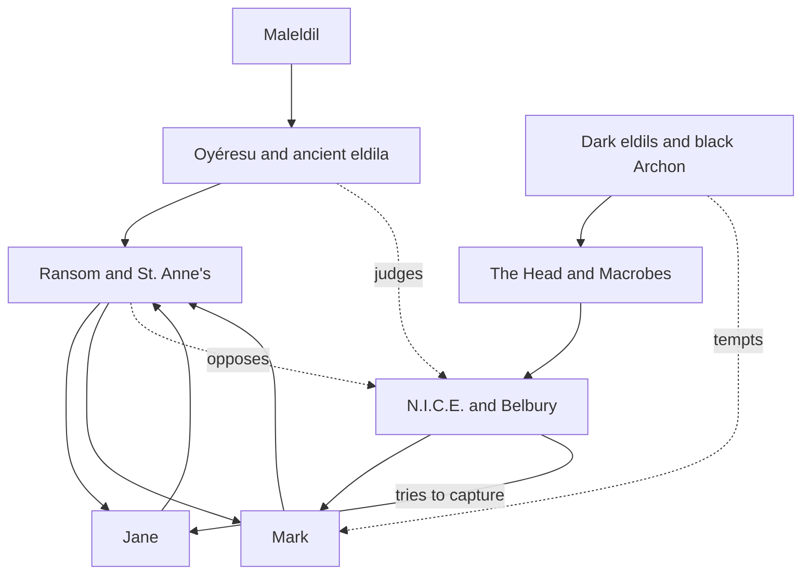
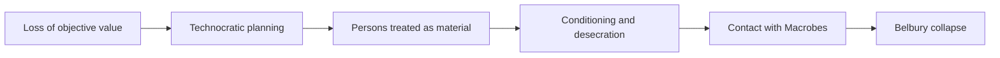

# The Ideas Underneath C. S. Lewis’s That Hideous Strength

## Executive Summary

*That Hideous Strength* is C. S. Lewis’s most explicit fictional dramatization of the argument he had made non-fictionally in *The Abolition of Man*: once a culture loses confidence in objective value, it does not become neutral or humane; it becomes manipulable, technocratic, and finally demonic. Lewis says exactly this in the novel’s preface, calling it a fairy-tale with a “serious point” continuous with *The Abolition of Man*, and he later clarified against J. B. S. Haldane that his real target was not scientists as such but a false view of value, the lure of an “inner circle,” and the “disciplined cruelty of some ideological oligarchy.” citeturn14view0turn22view0turn29view0

The novel’s metaphysic is hierarchical and participatory: reality is not flat matter plus private feeling, but an ordered cosmos populated by rational, supramundane beings beneath God and above human beings. In Lewis’s idiom, the Oyéresu are planetary “Intelligences,” the eldila are powerful rational spirits, and Earth is already compromised by hostile spiritual powers. This hierarchy is neither decorative mythology nor a mere allegorical superstructure. Lewis presents it as the real ontological frame in which human moral choices occur. That is why the book’s argument keeps returning to obedience, objective truth, creatureliness, and the difference between using persons and meeting them. citeturn32view2turn32view3turn30view2turn31view3

Lewis’s demons do not ally with the N.I.C.E. because the demons are “really scientific.” They ally because Belbury has made itself spiritually usable. The N.I.C.E. rejects objective morality, treats persons as material for conditioning, substitutes technique for wisdom, and reduces truth to utility and power. Those habits do not merely resemble demonic temptation; in Lewis’s Christian cosmology they become openings through which hostile intelligences can act. The novel therefore insists that scientism and occultism are not opposites. Once science is detached from truth and moral law, it bends back toward magic: both seek control, both suppress scruple, and both promise power over nature that always becomes power over other people. citeturn32view0turn34view1turn39view0turn22view0

Historically, Lewis was writing at the end of the Second World War in a climate saturated by state planning, managerial expertise, eugenics discourse, and high-profile scientific futurism. The technocracy movement had made rule by technical elites a recognizable ideal in the early twentieth century; British eugenics remained culturally influential even after the Nazi discrediting of the term; and writers such as J. B. S. Haldane and J. D. Bernal had already imagined ectogenesis, species-management, and near-limitless technoscientific remaking of human life. Orwell’s review of the novel, published on 16 August 1945, only days after Hiroshima and Nagasaki, objected to Lewis’s supernaturalism but conceded that the central conspiracy was not “outrageously improbable.” citeturn8search3turn8search2turn8search10turn8search0turn8search4turn44search8turn44search12turn45search1turn45search6

What finally happens in the novel is not merely that “the good side wins.” More specifically, Lewis shows that evil overreaches. The N.I.C.E. attempts to combine modern administration, post-moral science, and premodern magical power by seizing Merlin and serving the “Macrobes.” In Ransom’s interpretation, that project constitutes a Babel-like assault on the cosmic order. Their punishment is accordingly anti-Babelic: linguistic disintegration, social chaos, animal revolt, the destruction of the Head, and the unraveling of the human selves that had tried to become pure function. The dark eldils are not shown as annihilated in any absolute sense; what collapses is their Belbury operation and the human apparatus that made it possible. citeturn41view0turn38view4turn40view0turn42view0

## Lewis’s Metaphysical and Moral Architecture

Lewis tells the reader in the preface how to read the book. He calls it a fairy-tale because the fantasy grows out of ordinary life, and he says directly that it is a “tall story about devilry” whose serious point is the same one he had tried to make in *The Abolition of Man*. That framing matters. Lewis is not using fantasy to escape reality; he is using fantasy to reveal what ordinary, respectable modern life is doing when its professions, institutions, and slogans are spiritually unmasked. The novel therefore proceeds from marriage, college politics, and committee procedure into angelology, demonic influence, and planetary descent without treating the latter as a break from the former. citeturn14view0turn20search0turn7search2

The underlying reality of the novel is hierarchical. Human beings are not the highest intelligences in the cosmos, still less self-grounding wills. In conversation at St. Anne’s, the Oyéresu are described not simply as “angels” in a loose devotional sense but more technically as “Intelligences,” and the descending planetary powers are presented as ancient eldilic steersmen of worlds. Ransom’s party is therefore not anti-human; it is anti-rebellion. Human flourishing depends on rightly ordered relation to higher goods and higher beings rather than emancipation from them. Lewis’s imagination here resonates strongly with the medieval cosmological model he would later describe in *The Discarded Image*, and scholarship has repeatedly read *That Hideous Strength* as one of Lewis’s most thorough fictional enactments of that old hierarchical cosmos. citeturn32view2turn32view3turn10search0turn10search12turn7search2turn7search3

That hierarchy is moral as well as metaphysical. Dimble remarks that no conscious being is ever truly neutral before God; sooner or later all apparent middle ground shrinks. Later he formulates one of the novel’s deepest principles: history “hardens and narrows,” good becomes more itself, bad becomes more itself, and “the possibilities of even apparent neutrality are always diminishing” in a world sorting itself toward judgment. This is Lewis’s answer to liberal proceduralism and to moral relativism alike. The novel does not imagine evil as cartoonish wickedness transparent from the outset. It imagines evil as a long sequence of ordinary evasions that slowly make neutrality impossible. citeturn32view2turn36view0turn36view2

Free will in the novel is therefore real but not abstractly autonomous. Jane’s conversion arc is structured around the discovery that freedom is not maximum reservation or perpetual self-protection. Ransom tells her that equality “guards life” but does not generate it, and that in marriage she has confused companionship with a deeper reciprocity that requires humility and ordered gift. Lewis’s formulation here is famously controversial, but in the architecture of the novel it serves a larger point: creaturely freedom is not self-assertion against order but delighted participation in it. That is why Ransom can later say that obedience and rule are “more like a dance than a drill.” The issue is not naked domination; it is a fittingness of relation in which love and hierarchy are not enemies. citeturn37view0

This same participatory metaphysic appears in Lewis’s treatment of language and myth. When Jane hears the Great Tongue, the narration says that its meanings are not arbitrarily assigned but inherent, as the sun is reflected in a drop of water. Lewis is positing that reality is not finally raw material waiting for human naming and manipulation. It is sign-bearing, value-laden, and meaningful prior to our use of it. That is one reason the novel’s mythic dimension is not irrationalism. Lewis is arguing that myth and reason are allies when both are subordinated to reality. In the preface he defends fairy-tale form; in the novel itself he restores mythic language not to replace reason but to heal reason from reductionism. citeturn30view3turn14view0turn43search20

Lewis’s correspondence gives helpful, if indirect, confirmation here. As quoted from *Collected Letters* in recent scholarship, Lewis’s engagement with Martin Buber shows that he valued Buber’s insistence on relation while resisting what he saw as exaggeration and theological incompleteness. He could say that Buber made one crucial point well, and later summarize that God is most fully real to us as “Thou,” while also insisting that the Incarnation and the plurality of human relations complicate any simple I–Thou dualism. Those letters do not explicitly gloss *That Hideous Strength*, but they illuminate why chapter XIV bears the title “Real Life is Meeting”: Lewis treats relation, encounter, and address as metaphysically basic, whereas Belbury treats all relation as analysis, conditioning, or use. citeturn28view0turn24search5

Lewis’s strongest moral antithesis in the novel is thus not “religion versus science” but encounter versus manipulation. Bill Hingest says that once you “study” men, you want to pull them to bits and replace them; you cannot properly study men, only come to know them. The line is centrally important because it anticipates the whole anti-N.I.C.E. case. The novel’s villains are not condemned for acquiring knowledge; they are condemned for adopting a stance toward persons that converts knowledge into invasive control. The same contrast structures Mark’s breakthrough in the Objective Room: when asked to desecrate the crucifix in order to prove “objectivity,” he recoils not because of prior orthodoxy but because instrumental reason suddenly reveals itself as moral ugliness. citeturn34view2turn39view0

## The Demonic Order and Christian Cosmology

The demonic beings in *That Hideous Strength* are not free-floating horror effects. They belong to the trilogy’s Christian cosmology. MacPhee explains to Jane that eldila, if they exist, are not planetary natives but a different kind of rational creature, some attached to particular worlds and some moving through the depths of space. He also says that the eldils concentrated on Earth are hostile, that Earth is effectively the headquarters of a criminal class among these spirits, and that the Director claims communication not with the terrestrial dark powers but with friendly eldila from beyond Earth. In Lewis’s world, then, “outer space” is not empty but morally differentiated. citeturn31view3

The Oyéresu are the highest created rulers immediately relevant to the novel’s action: planetary intelligences or governors, not identical with guardian angels and certainly not gods in the pagan or modern autonomous sense. Lewis underscores creaturely hierarchy even when presenting their grandeur. When Jove descends in chapter XV, the narration dwells on his majesty but adds that human confusion of Jove with the Creator arose because people did not imagine how many steps the scale of created being rises above him. The point is theological precision. Lewis wants awe without paganism, and cosmic magnificence without metaphysical competition with God. citeturn30view2turn32view2

The user’s “Bent One” is best understood in the language *That Hideous Strength* itself uses: Earth’s “black Archon,” the fallen terrestrial ruler whose earthly counterpart and parasitic host of dark eldils stand behind the conspiracy. Lewis avoids systematic demonology here; he dramatizes it. The demonic order is shown not as a rival kingdom equal to heaven but as a parasitic corruption of created hierarchy. Its powers work by invasion, distortion, and counterfeit mediation: through dreams, through the preserved Head, through ideological conditioning, through the promise of disembodied life, and through the reduction of conscience to chemistry. That is why the N.I.C.E.’s “Macrobes” are a false naming of what are really hostile intelligences. The term sounds scientific; the reality is spiritual. citeturn31view2turn30view0turn32view0

What do these beings seek? At the broadest level, they seek to consolidate the Bent Earth in its rebellion against the divine order. At the human level, their aims are more specific. They want to capture Merlin, unite ancient earth-magic with modern technocratic organization, detach intellect from organic and moral life, and effect a program of social engineering that treats most human beings as expendable material. They also want to abolish scruple by habituating people to increasingly repugnant acts. Ransom identifies their design as very old: the sciences have been “warped” toward power, objective truth has been despaired of, inherited morality has weakened, and now the conspirators are trying to bend all this back into contact with an older occult power. That is the human face of the demonic plan. citeturn32view0turn34view1turn30view0

Their motives, however, are not identical with those of their human collaborators. The human planners want prestige, survival, centralized control, immortality, belonging, victory over rivals, and sometimes merely career advancement. The demonic intelligences want spiritual deformation. They are satisfied when human beings become less capable of repentance, relation, embodied delight, and responsibility. This difference matters because it explains the recurrent irony of Belbury. Its members think they are joining the strongest realism; in fact they are becoming less real. Frost’s initiation process seeks “objectivity” by severing disgust, pity, reverence, and personhood until consciousness itself becomes an intolerable illusion. In Lewis’s Christian frame, that is not liberation but damnation-in-process. citeturn30view0turn39view0turn40view0

The fate of these demonic aims inside the novel is failure through overreach. Ransom tells Merlin that the Hideous Strength holds Earth in its fist and that, had the planners not made one decisive mistake, hope would have been nearly extinguished; but because they reached upward with their own rebellious will, they “pulled down Deep Heaven” on themselves. That line interprets the climax. Evil is not finally defeated by superior human counter-technique. It is defeated because in trying to storm the cosmic order it summons judgment. The descent of the planetary powers, the corruption of language at the banquet, and the destruction of Belbury are all forms of that judgment. The text does not narrate the final annihilation of the dark eldils as such; it narrates the ruin of their specific Belbury enterprise and of the people who became its willing instruments. citeturn41view0turn32view3turn42view0turn40view0

## Why the Demons Need the N.I.C.E.

Lewis’s most original move in the novel is to show demons working through a secular scientific bureaucracy rather than through overtly religious occultists. This is the book’s sharpest critique of scientism. Scientism, for Lewis, is not science but an outlook that treats technique as morally self-justifying, objective value as illusory, and human beings as manageable material. In his reply to Haldane, Lewis says the novel was misunderstood if taken as an attack on scientists as such. The target, he says, is a certain view of values, the seduction of the ruling clique, and the cruelty of ideological oligarchy. Scholarship from Lewis specialists has repeatedly made the same point: *That Hideous Strength* opposes not chemistry or physics as such, but “the constructive fusion between the state and the laboratory” when ethical and religious limits are gone. citeturn22view0turn29view0turn43search1turn20search0turn43search12

Mechanically, the alliance works because the N.I.C.E. and the demons share methods even when they do not share motives. Both are anti-teleological: they deny that human nature has a given end that deserves reverence. Both are managerial: they prefer planning, conditioning, selection, and elimination to persuasion or repentance. Both are instrumental: they evaluate acts by efficiency or outcome rather than by intrinsic rightness. Both are anti-personal: they reduce the human being to specimen, patient, object, population, or component. Both are austerely hostile to creaturely dependence: bodies, animals, seasons, sex, death, and vulnerability are all treated as failures to be overcome. That common procedural grammar is what allows the N.I.C.E. to become, in effect, a laboratory for demonic inhabitation. citeturn34view1turn34view0turn39view0turn43search20

Filostrato is the clearest mouthpiece for this anti-nature metaphysic. He wants trees replaced by perfected aluminum imitations, birds by switch-operated artifacts, and finally the planet itself “shaved” clean of living untidiness. He presents the Institute’s purpose as conquest of death or, equivalently, conquest of organic life. In the same sequence he admits the hidden logic of the phrase “Man’s power over Nature”: it always means power of some men over other men, with nature as instrument. Lewis is here fictionalizing the central claim of *The Abolition of Man*: the more completely “nature” is conquered, the more completely humanity is divided into conditioners and conditioned. citeturn34view0turn34view1turn9search14

The preserved Head concentrates the same critique. It is not real immortality but a grisly counterfeit: detached intelligence, or rather the fantasy of intelligence detached from body, relation, and moral accountability. Frost’s scientific vocabulary of “Macrobes” is crucial because it reveals the precise trick Lewis is anatomizing. The demonic must now appear under a technologically plausible name. The old devils return as post-biological beings, superior organisms, or nonhuman intelligences contacted through a scientific elite. Lewis had already seen this logic elsewhere and described it memorably in his Haldane reply: if any of his fictions could be mistaken for attacks on scientists, the real target would still be scientism, especially the belief that the supreme end is merely preserving the species, even at the cost of pity, happiness, and freedom. citeturn30view0turn22view0

Mark’s moral collapse shows the psychology of compromise. He is not initially a sadist or ideologue; he is eager for the “inner circle,” anxious about status, professionally vain, and morally limp. Lewis’s interest lies in how this ordinary soul becomes usable. Hardcastle teaches “elasticity,” Wither dissolves clarity into euphemism and procedural vagueness, Fear of exclusion keeps Mark pliable, and successive small compliances prepare him for larger ones. By the time Frost invites him into the deepest circle, the temptation is almost purely formal: no longer sex, money, or career, but initiation itself, the thrill of ultimate access. Lewis’s point is bleak and exacting. Evil often recruits not by persuading people of monstrous goals, but by making them want to remain adjacent to the people who have those goals. citeturn38view0turn38view1turn38view2

The “Objective Room” sharpens Lewis’s diagnosis of instrumental rationality. Frost treats desecration as a laboratory exercise designed to uproot subterranean residues of belief. To become objective, Mark must perform an explicit act against the inherited sacred. Lewis’s brilliance here is to show that the process is not neutral even by empiricist standards. The exercise is as symbolically charged as any liturgy; it is anti-liturgy masquerading as science. What Belbury calls objectivity is in fact a disciplined training in moral desensitization. It does not remove value; it installs a new value system in which desecration, distance, and domination are proofs of enlightenment. citeturn39view0

This explains why demons and secular planners can cooperate despite differing aims. The planners want remade humanity; the demons want dehumanization. The planners want durable control; the demons want rebellion against God carried to its spiritual end. But the path is the same: abolish inherited scruple, desacralize persons, invert language, normalize cruelty, and treat every reality as available for redesign. At that point the alliance is not accidental. The N.I.C.E. has prepared human material precisely suited to demonic use. Lewis’s critique of scientism, then, is not antiquarian fear of laboratories; it is a metaphysical warning that technical mastery without moral ontology will recruit transcendent evil even while denying transcendence. citeturn32view0turn22view0turn43search1turn43search20

## Plot, Character, and Thematic Synthesis

The novel’s central plot may be summarized as a contest over what human beings are for. Belbury answers: for conditioning, selective survival, manufactured immortality, and centralized rule. St. Anne’s answers: for creaturely participation in a divinely ordered cosmos, where obedience is not annihilation but right relation, and where the person is not raw material. Mark and Jane begin on the boundary between these worlds. Mark is seduced by institutional ascent; Jane is seduced by autonomous self-possession. Both must learn, in different ways, that the self is not secured by reserve, analysis, or detachment. It is secured only by rightly ordered love. citeturn14view0turn37view0turn40view1

At the level of structure, scholars have often noted that Lewis alternates Belbury and St. Anne’s as contrasting settings and contrasted modes of life. Doris Myers emphasizes the importance of language in Lewis’s political imagination, and studies of the novel’s “narrative dualism” similarly read the two houses as rival ontologies rather than merely rival teams. That is convincing. Belbury is all euphemism, procedure, abstraction, and coercive expertise. St. Anne’s is not sentimental or anti-intellectual, but it is ordered toward hospitality, prayer, plain speech, and receptive waiting. Even MacPhee, the house skeptic, belongs on the right side because Lewis refuses to equate reason with disbelief in transcendence; the issue is whether reason remains answerable to reality beyond technique. citeturn7search3turn43search11turn6search17turn29view1

The novel’s end gives each major figure the fate proper to his or her chosen ontology. Frost, who has denied the self and reduced consciousness to by-product, becomes the supreme exhibit of that lie’s horror: his body acts while his denied consciousness protests, and in death he half perceives the soul and responsibility he hates. Mark, who has long pursued the wrong circle, survives because he finally refuses desecration and later recognizes that his lifelong ambition itself was misdirected. Jane, whose beauty and freedom had been hoarded in self-possession, is reoriented toward gift, marriage, and fecund delight. The climax is therefore punitive and restorative at once. It destroys the anti-world Belbury had built and restores the possibility of genuinely human meeting. citeturn40view0turn40view1turn37view0

### Comparative Table

| Character or group | Core motive | Characteristic methods | Outcome in the novel |
|---|---|---|---|
| **N.I.C.E.** | Centralized control, social engineering, managed evolution, conquest of organic limits | Bureaucratic vagueness, propaganda, police force, selective breeding, conditioning, alliance with “Macrobes,” attempted capture of Merlin | Babel-like collapse at Belbury; leadership dies or is scattered; the project of coordinated experiment becomes coordinated self-destruction |
| **Mark and Jane Studdock** | Mark seeks admission to the inner circle; Jane initially seeks autonomous self-possession and freedom from surrender | Mark adapts, rationalizes, and delays refusal; Jane analyzes, withholds, and resists obedience until transformed | Mark’s refusal in the Objective Room becomes the hinge of recovery; Jane’s submission becomes participatory, relational, and marital rather than merely private |
| **Ransom and St. Anne’s** | Fidelity to Maleldil, protection of Earth from the Hideous Strength, preservation of the person against manipulation | Waiting, prayer, hospitable order, interpretive wisdom, use of Jane’s dreams, deployment of Merlin under heavenly authority | They do not “out-technique” Belbury; they receive and cooperate with heavenly descent, after which the conspiracy collapses |
| **The eldila and Oyéresu** | Maintenance and restoration of created order under Maleldil | Counsel, planetary mediation, descent, empowerment of creaturely goods rather than replacement of them | Their intervention breaks the Belbury project, exposes false autonomy, and reorders the story’s moral universe into visible judgment |
| **The Bent Earth’s dark powers** | Deformation of humanity, consolidation of rebellion, union of post-moral science with older occult control | Parasitic inhabitation, counterfeit scientific language, exploitation of ambition, habituation to desecration, use of the Head | Their immediate Belbury operation fails when heaven is invoked against them; the novel leaves cosmic evil itself ongoing, but this campaign is decisively ruined |

This table condenses evidence from the preface and from chapters II, VIII–IX, XIV–XVII, together with Lewis’s reply to Haldane and standard Lewis scholarship on the trilogy’s political and theological architecture. citeturn14view0turn30view0turn32view0turn34view1turn39view0turn40view0turn22view0turn7search2turn43search1

### Timeline of Key Events and Themes

| Chapter or scene | Plot event | Thematic development |
|---|---|---|
| **Preface** | Lewis defines the book as a fairy-tale with a serious point continuous with *The Abolition of Man* | Myth is not escapism; fantasy reveals ordinary modern evil |
| **Sale of College Property** | Bracton yields to the N.I.C.E. through committee maneuver and opacity | Technocracy begins in institutional process, not open tyranny |
| **Dinner with the Sub-Warden / early Belbury** | Mark is courted, flattered, and softened for use | Moral compromise begins with vanity and the desire for belonging |
| **Jane’s first visits to St. Anne’s** | Dreams are treated seriously; Ransom diagnoses Jane’s false ideal of equality and freedom | Personhood requires humility, receptivity, and right order |
| **Filostrato’s speculations** | Living nature is denounced; the artificial and immortal are praised | Anti-organicism, anti-body ideology, and the abolition of creatureliness |
| **The Saracen’s Head** | Belbury’s “scientific” project is revealed as demonic mediation through the Head and the Macrobes | Scientism bends toward magic; truth collapses into power |
| **Battle Begun / Merlin recovered** | St. Anne’s secures Merlin under Ransom, not under Belbury | Ancient power must be subordinated to heaven, not fused with technocracy |
| **They have pulled down Deep Heaven on their Heads** | Ransom interprets Belbury’s upward reach as a Babel-like provocation | Evil collapses by overreach; judgment is invited by rebellion |
| **Real Life is Meeting** | Mark’s initiation deepens; Jane’s inward transformation ripens | The contrast between use and encounter reaches maximum intensity |
| **The Descent of the Gods** | Planetary powers descend on St. Anne’s | Myth discloses ontology; higher order becomes historically operative |
| **Banquet at Belbury** | Linguistic confusion, panic, animal violence, deaths of leaders | Anti-Babel judgment; desacralized language and society disintegrate |
| **Venus at St. Anne’s** | Mark is received; Jane’s marriage is renewed under Venusian blessing | Restored eros is fecund, embodied, and ordered to gift rather than control |

The timeline aligns the novel’s action with the thematic arc Lewis built into its chapter ordering and its alternating settings. citeturn14view0turn32view0turn37view0turn39view0turn41view0turn42view0

### Suggested Diagrams

The first diagram shows the moral and metaphysical alignment of the novel’s agencies.

The second diagram focuses on Lewis’s criticism of scientism as a pipeline from abstraction to spiritual corruption.

These diagrams are visual syntheses of the novel’s primary-text logic: hierarchy descends from Maleldil through the Oyéresu, while Belbury ascends by rebellion until it draws judgment onto itself. citeturn14view0turn32view0turn30view0turn41view0

## Historical Context, Scholarship, and Limitations

Lewis wrote the novel during the war years, and the preface says the story’s period is vaguely “after the war”; the official Lewis chronology records publication in August 1945. The timing matters. Lewis was responding to an era in which large-scale planning, wartime bureaucracy, propaganda, and scientific prestige had all intensified at once. The N.I.C.E. is not simply “Nazism in disguise,” nor simply “socialism in disguise.” Lewis’s own clarification against Haldane is more precise: he feared the union of post-moral expertise with ideological oligarchy, whatever party label such power wore. citeturn14view0turn20search6turn22view0

The historical analogues are clear enough. Technocracy had become a public movement in the early twentieth century and was widely discussed in the 1930s as government by technical experts guided by technical imperatives. Eugenics, first named by Francis Galton, retained wide influence in British and American policy and culture before and even after the Nazi catastrophe, often under softer vocabularies of national efficiency, public health, and reproductive planning. Lewis puts these currents directly into Feverstone’s and Filostrato’s mouths: sterilization, liquidation of the “unfit,” selective breeding, prenatal education, and biochemical conditioning. The novel therefore belongs not only to Christian fantasy but to the postwar genealogy of anti-technocratic dystopia. citeturn8search3turn8search2turn8search10turn22view0

J. B. S. Haldane and J. D. Bernal are especially relevant contexts. Haldane’s *Daedalus* imagined ectogenesis and treated eugenic futures as plausible scientific developments; later commentary on the text emphasizes exactly that feature. Bernal’s *The World, the Flesh and the Devil* tried to map the future limits of technoscientific advance and imagined that obstacles in the material, bodily, and psychological realms might be overcome by scientific rationality. Lewis was not fantasizing in a vacuum. He was fictionalizing, satirically and theologically, trajectories already being proposed by celebrated intellectuals. citeturn8search0turn8search4turn44search8turn44search12

Major Lewis scholars generally converge on this point, though with different emphases. Sanford Schwartz stresses the novel’s critique of eugenic planning and the aspiration to seize evolutionary control. David Downing reads the trilogy as deeply shaped by Lewis’s medieval scholarship and Christian cosmology. Doris Myers highlights the importance of language and public rhetoric in Lewis’s political imagination. Peter Schakel’s comparison with Orwell shows how closely Lewis’s dystopia tracks concerns about managed society and scientism even while differing sharply in theological resolution. More recent scholarship has developed the same insight in different directions: “narrative dualism” studies the two-house structure as a conflict of worlds, while work on sacramental ontology emphasizes Lewis’s conviction that creation is not inert matter but sign-bearing reality resistant to reduction. citeturn7search0turn7search2turn7search3turn43search1turn43search11turn43search20turn43search18

Reception at the moment of publication confirms how contemporary the book felt. Orwell’s review in the *Manchester Evening News* appeared on 16 August 1945. He objected strongly to the supernatural ending, but he also admitted that the basic technocratic conspiracy Lewis imagines was not implausible. Read beside Hiroshima and Nagasaki, that is revealing. Orwell disliked Lewis’s miracle; he did not dismiss Lewis’s diagnosis of the managerial-scientific temptation. The two writers, from very different ideological locations, both sensed the danger of modernity when power, expertise, and depersonalization fuse. citeturn45search1turn45search6turn43search1

A final caution is necessary. Accessible web sources allow unusually strong access to the novel itself and to some authorial clarifications, but they are less generous with Lewis’s *letters* in full. I was able to confirm, through scholarship quoting *Collected Letters*, that Lewis’s engagement with Martin Buber was serious, qualified, and relevant to the novel’s relational metaphysic; and I was able to confirm Lewis’s anti-scientism clarification from his Haldane reply. I was **not** able, from high-confidence web-accessible primary sources alone, to verify more extensive THS-specific private correspondence about composition or every later retrospective comment Lewis may have made. That limitation affects the letters portion more than the novel analysis itself. citeturn28view0turn22view0