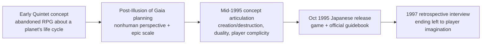
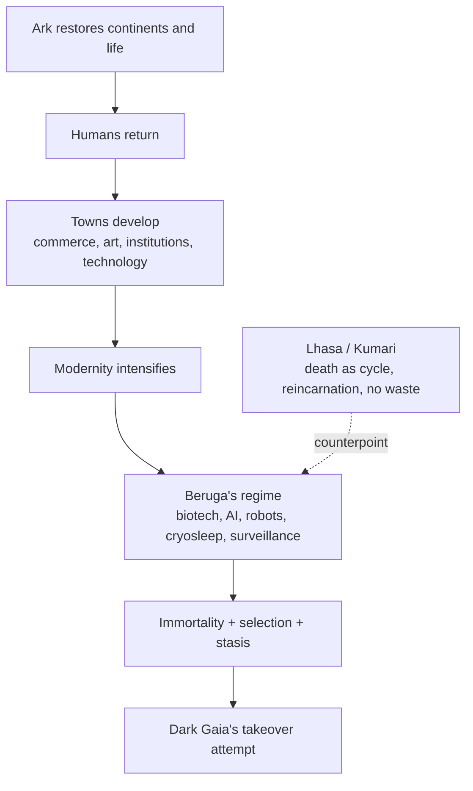

# Terranigma and the Politics of Creation

## Executive summary

*Terranigma* was not designed as a simple “save the world” action RPG. The strongest primary-source evidence points to a more ambitious program: Tomoyoshi Miyazaki and Quintet wanted to make a planetary-history game that fused the nonhuman perspective of *Soul Blazer* with the large, “epic” scale of *Illusion of Gaia*; they framed its core themes as **creation and destruction**, **duality**, and the player’s **complicity** in development. Miyazaki explicitly said the story’s heart was “the perspective of the Earth,” while scenario writer Reiko Takebayashi said she wanted players to wonder whether developing a town was “really right” if that meant destroying birds’ habitat. Quintet also treated the project as a culmination of older, unrealized ideas: Miyazaki later recalled that an abandoned early RPG about “the entire life cycle of a planet” eventually “formed the basis of *Terranigma*.” citeturn8view0turn33view0turn10view0

Read from in-game elements alone, *Terranigma* presents a coherent thematic structure. Its opening says Earth has “two hearts,” Lightside and Darkside; Lightside brings life and technology, while Darkside brings “distortion” and victims. The game then repeatedly contrasts healthy cyclical mortality with pathological attempts to abolish death. Lhasa teaches that “all life turns as a wheel” and that “not one thing is wasted”; Beruga’s regime promises an “eternal paradise,” immortality, and finally an “unchanging world.” The restoration of civilization is therefore not portrayed as flatly evil but as morally double-edged: history, art, trade, cities, and technical achievement are all revived by Ark, yet the same growth can become domination, ecological loss, social abstraction, cultic hero-worship, and eugenic selection. citeturn35view0turn38view3turn34view0turn39view2turn40view1turn41view0

The game’s “scientific/technocratic dystopia” is best understood not as a blanket rejection of science, but as a critique of **science severed from reciprocity, mortality, and limits**. The opening itself places technology on the Lightside, and Beruga’s database states that his DNA work cured recurrent disease, extended life, improved AI, and won him a “World Peace Prize”; his lab later also produced a powerful vaccine during the Asmodeus pandemic. Science, then, is initially restorative. It becomes aligned with evil only when it shifts from healing to **selection**, **control**, and **stasis**: Beruga’s answer to overpopulation is to kill the “unnecessary” and preserve only the “truly necessary”; his final ideal is “eternal life” and an “unchanging world.” That program matches Dark Gaia’s cosmology, because Dark Gaia is not merely “the devil” in a Christian sense but the Earth’s reverse face, the will of decline, distortion, and the abolition of living balance. citeturn35view0turn39view2turn40view0turn40view1turn41view0

Beruga’s goals, on the strongest primary evidence, were to survive the old world, awaken after human restoration, impose an immortal and selectively culled social order, and inaugurate a static world he explicitly links to “that person,” later confirmed at death to be Dark Gaia. Dark Gaia’s goals were broader: to reclaim the Earth for itself, to use Ark and the copied village of Crysta as instruments, and to collapse the balance between Light and Dark into a new order under its own principle. But some details remain uncertain. The script **does not explicitly say** Beruga created or deliberately released the Asmodeus virus, even though many fan readings assume that. Likewise, the game’s official English framing can sound more theologically absolute than the Japanese, which carefully presents “god” and “devil” as **names humans gave to the two wills**, not necessarily literal Abrahamic beings. citeturn38view1turn40view0turn40view2turn41view0turn35view0turn48view1

## Sources and method

This report prioritizes Japanese primary and official materials in four tiers. First are the original Japanese in-game texts, using a fan-maintained transcription of the Super Famicom script. Because these pages reproduce the game’s Japanese dialogue and system text, they are best treated as **quasi-primary** witnesses to the ROM script, though they are not publisher-hosted. Second are official materials: Square Enix’s current product page, the official Japanese guidebook scan archived online, and the official PAL English instruction booklet scan. Third are translated developer interviews and commentary collected by *shmuplations* from 1995 magazine interviews, a 1997 *Comptiq* interview, Quintet website comments, and soundtrack liner notes. Fourth are reputable secondary analyses used mainly to test or contextualize interpretations, not to override the Japanese sources. citeturn32search0turn32search4turn17view0turn15view0turn34view1turn35view0turn8view0turn33view0turn48view0turn48view1

Where Japanese and English frames diverge, I privilege the Japanese wording. That matters especially for terms like **神 / あくま** in the opening, where the Japanese presents them as names humans assigned to the two cosmic wills, and for the title **天地創造**, whose explicit “creation of heaven and earth” resonance is muted by the localized title *Terranigma*. It also matters because even sympathetic modern fan criticism notes that the PAL text is “a flawed translation,” which is useful as a warning but not as a substitute for the Japanese script. citeturn35view0turn32search0turn45search5turn48view1

## Development history and design goals

The clearest picture from developer testimony is that *Terranigma* was conceived as a **capstone project**: a planetary-history RPG, told from the Earth’s point of view, structured around duality, and delivered through an accessible but expressive action system. Miyazaki ties the game back to an abandoned early Quintet concept about “the entire life cycle of a planet”; later, after *Illusion of Gaia*, he says the specific trigger for *Terranigma* was dissatisfaction with *Soul Blazer*’s smaller set-piece feel and a desire to combine *Soul Blazer*’s nonhuman perspective with a larger epic. He also repeatedly defines *Terranigma* by its theme of linked opposites: creation/destruction, Darkside/Lightside, good/evil, and player action/consequence. citeturn33view0turn8view0

The following diagram synthesizes the project’s development trajectory from the available primary and official material. citeturn33view0turn8view0turn10view0turn32search4turn17view0

| Phase | Primary evidence and key quote | Analytical takeaway |
|---|---|---|
| Early Quintet concept | On the Quintet website, Miyazaki recalled that an abandoned early RPG was “meant to depict the entire life cycle of a planet,” and that “this idea did end up forming the basis of *Terranigma*.” citeturn33view0 | The game’s historical and cosmological scale was not a late affectation; it was rooted in a long-standing design ambition. |
| Planning after *Illusion of Gaia* | Miyazaki says planning began “very shortly after completing *Illusion of Gaia*,” and that the impetus was to combine *Soul Blazer*’s “non-human perspective” with a “big, epic” world. citeturn8view0 | *Terranigma* was framed as synthesis: estranged perspective plus macro-historical sweep. |
| Core theme articulation | Miyazaki: “destruction and creation are linked together.” Takebayashi says she wanted players to ask whether developing a town is right if it destroys birds’ natural habitat. citeturn8view0 | Development itself was designed as morally ambivalent, not simply heroic. |
| Earth’s-eye view | Miyazaki says “the heart of *Terranigma*’s story lies in the perspective of the Earth, and how it views human activity.” citeturn8view0 | Human history is to be judged from outside ordinary human self-importance. |
| Action-system brief | Miyazaki says he initially described the game as more “RPG-action” than “action-RPG,” while Hashimoto says Quintet wanted action that would also appeal beyond hardcore action players. Fujiwara says movement and animation were a major focus. citeturn8view0turn10view0 | The mechanics were meant to carry RPG meaning and emotional immediacy, not just combat difficulty. |
| July 1995 public framing | In the Horii/Miyazaki discussion, Miyazaki says the resurrection scenes should make players think “we create our own world,” and that he often used a world atlas to imagine scenes and events. A Japanese listing identifies this talk as *Weekly Famitsu* No. 344, July 21, 1995. citeturn10view0turn27search5 | The game’s geography and historicity were expressly tied to player agency and global imagination. |
| Official release | Square Enix’s official page lists the game as a Super Famicom action RPG released on 1995-10-20; archive metadata identifies the *Tenchi Sōzō Official Guide Book* as an ENIX publication from 1995. citeturn32search4turn17view0 | The title launched as a flagship late-SFC production with official support materials. |
| Retrospective ending stance | In the 1997 *Comptiq* interview, Miyazaki says the final scene’s conclusion is entrusted to “the player’s imagination.” citeturn33view0 | The ambiguity of the ending is deliberate design, not accidental incompleteness. |

One more developer-side clue is especially useful: the Enix producers’ soundtrack liner note says plainly that *Terranigma* was “a game created around a single theme.” That does not mean every scene has one univocal meaning, but it does support reading the game as **tightly concept-driven** rather than as an accumulation of cool set-pieces. citeturn33view0

## What the game says through its own systems and symbols

Even if all interviews vanished, the game itself would still support a strong thematic reading. The opening establishes a world of paired wills, not a single linear teleology. Chapter structure moves from continent restoration to plant, animal, human, genius, and hero resurrection; that sequence makes history feel authored, but never innocent. Later scripts repeatedly oppose ecological circulation, mortality, and reincarnation to immortalist control, centralized expertise, and frozen social order. The result is a game that treats “civilization” as both the fruit of human creativity and the site where creativity curdles into domination. citeturn35view0turn38view3turn34view0turn39view2turn40view1turn41view0

### Comparative analysis of in-game elements

| In-game element | Primary evidence | Plausible thematic reading |
|---|---|---|
| Opening demo cosmology | The opening says the planet had “two hearts,” Lightside and Darkside; Lightside produces new life and technology, Darkside brings ice ages, “distortion,” and victims. citeturn35view0 | The game begins from **dialectical balance**, not moral monism. Progress and decline are structurally entangled. |
| Ark’s mission in official framing | The official English manual says Ark’s journey becomes one in which he must resurrect continents, “revive all forms of life,” and “re-establish civilization.” citeturn15view0 | Civilization is part of the project from the outset; the later dystopian turn is therefore internally generated, not an external betrayal of the original mission. |
| Lhasa and Kumari | Lhasa teaches sky burial and reincarnation: “生命はすべて 輪となって まわっている。ムダなものなど ひとつもない.” Kumari is described as repeatedly reincarnating to watch the world’s flow. citeturn38view3 | The game endorses mortality as participation in a cycle, not as failure. |
| Freedom’s eventual development | Later script text describes Freedom as “ビジネスの 最前線を行く都市” and “流行の 最前線を行く都市,” a city at the front line of business and fashion. citeturn45search1 | Town growth is exhilarating but also abstracts life into markets, trends, and urban tempo. |
| Grand Mosque and Beruga’s cult | Believers call Beruga a savior who will build an “eternal paradise,” free people from suffering, and make even death powerless. citeturn34view0 | Scientific authority is staged as a pseudo-religion of salvation and exemption from mortality. |
| Beruga’s database and zombies | The database credits Beruga with DNA cures, life extension, AI progress, and vaccine work during the Asmodeus plague; Beruga later shows Ark a zombie-immortality system and answers overpopulation with selective killing. citeturn39view2turn40view0 | Science is first restorative, then transformed into **biopolitical sorting**. The villainy lies in optimization without reciprocity. |
| Crysta as copied village | After Dark Gaia’s defeat, the light emissary tells Ark that Dark Gaia made both Ark and Crysta by copying the light-side original. citeturn40view2 | The game destabilizes origin and identity: even “home” is manufactured, mirrored, contingent. |
| Gaia Stone and Dark Gaia battle | At the Gaia Stone, the script glosses creation as taking form and destruction as the loss of form; Dark Gaia also calls itself “the reverse face of the Earth.” citeturn41view0 | Dark Gaia is not merely an external invader; it is a constitutive principle of worldly becoming and undoing. |
| Ark’s postwar guilt | Ark says he fears he may have made the planet unhappy because the world’s recovery and civilization were part of Dark Gaia’s plot; Yomi answers that bad events always occur where there is life, but good things also exist in equal measure. citeturn41view0 | The game refuses both naïve progressism and total despair. It pushes the player toward tragic responsibility. |
| Yomi on evolution and degeneration | Yomi says life’s forms all evolved from an undetermined origin, then jokes that humans may “degenerate” back toward his shape as they rely more on machines. citeturn41view0 | Evolution is not pure ascent. Civilization contains the possibility of regression disguised as advancement. |

In other words, the game’s own architecture supports six major themes: **duality**, **creation-through-destruction**, **the necessity of death**, **history as player-authored but morally compromised**, **home as fragile and possibly fabricated**, and **modernity as both spectacle and danger**. Those themes line up closely with the developer interviews, which is one reason the interviews feel clarifying rather than revisionist. citeturn35view0turn38view3turn40view0turn41view0turn8view0

## Science, Beruga, and the technocratic turn

### Why restoration bends toward dystopia

The game portrays restored civilization moving toward a scientific/technocratic dystopia because its development model is intentionally **ambivalent**. Takebayashi’s clearest statement is the bird-habitat example: she wanted players to ask whether it is right to develop a town if that development destroys nature, and she says the player is complicit whichever path they accept. In-game, this becomes a historical structure. Ark revives life, then humans, then social institutions, commerce, infrastructure, and technological ambition. The game does not pull the rug from under the player at the last second; it conditions the player to desire growth and then reveals growth’s cost. citeturn8view0turn15view0turn45search1turn48view1

The opening already foreshadows the pattern. Technology first appears on Lightside: “tool-using life” emerges, and “new technologies” are created. But the same opening also says that under Darkside, **ひずみ**—distortion, warp, structural strain—appears, producing victims. That wording matters. The danger is not “technology exists”; it is that human making can become unbalanced, overextended, and destructive. citeturn35view0

A simple way to visualize the game’s historical logic is this: restored life leads to restored society; restored society leads to intensified human power; intensified power, if detached from death and reciprocity, becomes Beruga’s technocracy. That is not a separate story branch—it is the endpoint latent within the game’s own resurrection project. citeturn15view0turn35view0turn39view2turn40view0turn40view1

The strongest in-game contrast is between **Lhasa** and **Grand Mosque**. Lhasa articulates the game’s anti-stasis metaphysics in unusually plain terms:

> 「生命はすべて 輪となって まわっている。ムダなものなど ひとつもないのさ。」  
> “All life turns as a wheel. Nothing is wasted.”  

> 「我々は 人が死ぬことを 悲しいこととは 思わない。」  
> “We do not think a person’s death is simply a sad thing.”  

The village’s worldview is cyclical, ecological, and reincarnational. Death is not denied; it is integrated into meaning. citeturn38view3

Grand Mosque teaches the opposite:

> 「永遠の楽園を きずきあげてくださるのだ！」  
> “He will build an eternal paradise!”  

> 「死さえも 楽園の前には無力だ。」  
> “Even death is powerless before paradise.”  

Here, salvation is not circulation but **exemption**: freedom from suffering, from death, from flux. That is why the game’s dystopian turn feels philosophically earned. It is the point at which civilization ceases to be historical life and becomes the dream of leaving history behind. citeturn34view0

### Why science is aligned with evil in the narrative

The short answer is that **science is not simply aligned with evil** in the narrative. The game aligns a **particular configuration of science** with evil: the form of science that seeks to negate mortality, classify human worth, and freeze a changing world into a managed one. The primary evidence for this distinction is Beruga himself. His database entries say that his work on DNA manipulation cured recurrent disease, that his advances in life extension and artificial intelligence were regarded as transformative, and that he won a “World Peace Prize.” During the Asmodeus airborne plague, his laboratory also produced a vaccine with an 80% recovery rate, though too little was available to save everyone. citeturn39view2

That is not the profile of a game saying “knowledge is evil.” Beruga’s earlier science is explicitly **healing**, **life-preserving**, and globally beneficent. Evil emerges only when Beruga turns from medicine to sovereignty. His zombie demonstration is the hinge:

> 「このシステムがあれば 人は 永遠に生きることができる。」  
> “With this system, people can live forever.”  

Ark immediately raises two objections: the revived dead look lonely and unnatural, and a deathless human race would quickly fill the Earth. Beruga’s response is the clearest single statement of his ethics:

> 「不必要な人間は殺し 本当に必要な人間だけを生かせばいい。」  
> “Kill the unnecessary humans and keep alive only the truly necessary ones.” citeturn40view0

This is why science looks evil in *Terranigma*: not because experimentation, tools, or medicine are condemned, but because **instrumental rationality without limits becomes eugenic government**. Even Beruga’s robots encode the problem. He cites the “three laws of robotics,” then adds a fourth, effectively: anything threatening him must be mercilessly annihilated. Scientific ethics are not absent; they are **subordinated to sovereign power**. citeturn40view0

The final version of Beruga’s ideal makes the issue explicit:

> 「あと一歩で 私と あの方の 世界が はじまる。」  
> “One more step and the world of myself and that person will begin.”  

> 「永遠の命が 不変の世界が 今 産声をあげようとしているのだ！」  
> “Eternal life—an unchanging world—is about to cry out into birth!” citeturn40view1

The evil here is **stasis**. Beruga’s world is not frightening because it is advanced, but because it aims to end the very conditions that make history, ecology, and ethical life possible: death, succession, unpredictability, and the equal necessity of apparently “unnecessary” beings. That is precisely why Lhasa’s worldview matters so much as a counter-text. citeturn38view3turn40view1

### Beruga’s motivations and goals

On a strict evidentiary reading, Beruga’s motivations and goals are these.

First, he wants to **survive across epochs** and re-emerge when humanity has returned. He tells Ark that when “the world died,” he entered a “long, long sleep” until the day humans revived. citeturn39view2

Second, he wants to **conquer death technologically**. His laboratory work, his zombie/immortality system, and the cult built around him all converge on a single promise: to make death powerless. citeturn34view0turn40view0

Third, he wants to **govern by selection**. His answer to the problem of immortality and population is not restraint, solidarity, or voluntary limits, but culling. The phrase “necessary” versus “unnecessary” humans is unmistakably eugenic. citeturn40view0

Fourth, he wants an **unchanging world**. His final speech links eternal life with a “不変の世界,” literally an unchanging or immutable world. This is a decisive clue: Beruga’s true enemy is not only death, but change itself. citeturn40view1

Fifth, he is aligned with **Dark Gaia**. Before the full reveal, he tells Ark that “that person” will soon rise from beneath the earth and knows all truth; at death, he cries “Dark Gaia-sama, help…,” which confirms the alliance rather than leaving it merely symbolic. citeturn40view0turn38view1

What the primary script does **not** let us say confidently is that Beruga originally created or deliberately released the Asmodeus virus. The database only states that the airborne plague spread, devastated world population, and that Beruga’s vaccine saved some people but not nearly enough. The popular fan theory that Beruga caused the apocalypse may be plausible as a speculative reading, but it is not firmly established by the cited primary evidence here. citeturn39view2

## Dark Gaia, endings, and uncertainties

### Dark Gaia’s motivations and goals

Dark Gaia is best read as both a **metaphysical principle** and an **active antagonist**. The opening defines Darkside as one of the planet’s two hearts, the source of ice ages and distortions, while also stressing that humans merely came to call the two wills “god” and “devil.” That framing avoids reducing Dark Gaia to a stock Satan figure. It is, first of all, the Earth’s reverse side. citeturn35view0

Dark Gaia’s own battle text confirms this. At the Gaia Stone, the script explains:

> 「創造とは 形ができること。破かいとは 形がなくなることだ。」  
> “Creation is when form comes into being. Destruction is when form disappears.”  

Dark Gaia then says:

> 「私は 地球の裏の顔。」  
> “I am the reverse face of the Earth.” citeturn41view0

This matters because it means Dark Gaia’s motivation is not simply “destroy everything because evil.” Its ontology is closer to **unmaking**, **decline**, and the return of formed life to formlessness. Yet the game also makes Dark Gaia strategically agentive. After its defeat, the light emissary tells Ark:

> 「ダークガイアは 地球を 自分のものにするため 君を作った。」  
> “Dark Gaia made you in order to make the Earth its own.”  

He adds that Dark Gaia copied the light-side original to create Ark and even copied the village of Crysta. In other words, Dark Gaia’s plan was to use the machinery of restoration for possession. Ark was bait, instrument, and partial double. citeturn40view2

The sequence around Neo Tokio and Beruga clarifies the strategy. Dark Gaia, through the Elder, drives Ark to rebuild the world. Civilization grows. Beruga awakens and becomes the avatar of immortalist technocracy. Neo Tokio is then crushed, and the chapter turns openly toward Dark Gaia’s return. The implication is that Dark Gaia does not merely want a dead planet; it wants a **restored and intensified** world whose contradictions can be seized and bent toward a new order. That is why Beruga’s static utopia and Dark Gaia’s world can be spoken of together. citeturn40view0turn40view1turn40view2

There is still ambiguity. Dark Gaia speaks of light and shadow becoming one for a “new departure” of the Earth, which could be read as total domination, a new cycle, or even a reset beyond current human categories. The strongest evidence supports the first reading—monopolization of the Earth by Dark Gaia—but it does not fully exclude the second. What is certain is that Dark Gaia’s program is anti-balance: once “the darkness has gone to sleep,” the light emissary says, the shared role of Ark and Crysta is over. The Earth was never meant to belong exclusively to one pole. citeturn41view0turn40view2

### Translation issues and alternative interpretations

A few translation and framing issues significantly affect interpretation.

| Issue | Japanese nuance | Why it matters |
|---|---|---|
| **Title** | **天地創造** explicitly evokes the “creation of heaven and earth,” while the localized title *Terranigma* is evocative but less scripturally direct. citeturn32search0turn45search5 | The Japanese title foregrounds cosmology and myth from the very start. |
| **“God” and “Devil”** | The opening says humans called the two wills “神” and “あくま.” They are names humans gave them, not a doctrinal revelation. citeturn35view0 | English readings can over-theologize the conflict into orthodox good-vs-evil. |
| **ひずみ** | The opening does not merely say Darkside creates evil; it says Darkside creates **distortion/strain** and victims. citeturn35view0 | This supports reading the game as critique of imbalance and deformation, not simple moral allegory. |
| **Beruga’s “world”** | His phrase is **不変の世界**: an unchanging, immutable world. citeturn40view1 | The issue is stasis, not scientific curiosity per se. |
| **Ark as “god”** | Yomi says Ark is what humans would call a god: **人間で言うところの 神**. citeturn41view0 | Ark is not straightforwardly a literal monotheistic deity; the phrasing is analogical. |
| **Interview access** | The most important developer comments are available in English translation via *shmuplations*; some raw print sources are identifiable, but not all are readily machine-readable here. citeturn8view0turn33view0turn27search5 | Some exact Japanese phrasings in interviews remain less secure than the in-game script. |

These nuances shape the best alternative interpretations.

A strong **anti-modernity** reading is clearly available: town development leads to commerce, hierarchy, urban abstraction, biotechnology cults, and finally catastrophe; Beruga is the endpoint of civilization’s hubris; and Dark Gaia profits from that process. The bird-habitat example from Takebayashi supports this strongly. citeturn8view0turn45search1turn40view1

But an equally serious, and I think stronger, reading is that the game is **not anti-civilization and not anti-science in general**. It warmly depicts art, travel, rebuilding, mutual aid, local commerce, and even certain forms of modern spectacle. The official mission includes re-establishing civilization; Beruga’s early work saves lives; and Yomi’s final answer insists that where life exists, both bad and good events necessarily do too. A modern fan analysis from *Destructoid* makes a useful secondary point here: the game’s best storytelling often works by letting the player *feel* that progress is both beautiful and compromising, rather than by issuing a single doctrinal verdict. citeturn15view0turn39view2turn41view0turn48view1

So the most evidence-based conclusion is this: *Terranigma* portrays the restoration of civilization leading toward technocracy **because its governing philosophy is duality**. Human making is glorious and dangerous at once. Science is aligned with evil **only when it becomes anti-cyclical**, when it denies death, classifies lives by utility, and seeks a frozen world. Beruga is the human embodiment of that temptation. Dark Gaia is its cosmic accomplice and deeper principle. Yet the game still refuses absolute pessimism. Even after Ark recognizes that his work helped enable disaster, the final logic is not “civilization was a mistake.” It is that history is tragic, generative, and irreversible—and that any world worth having must remain open to change, loss, and renewal. citeturn8view0turn35view0turn38view3turn40view0turn40view1turn40view2turn41view0